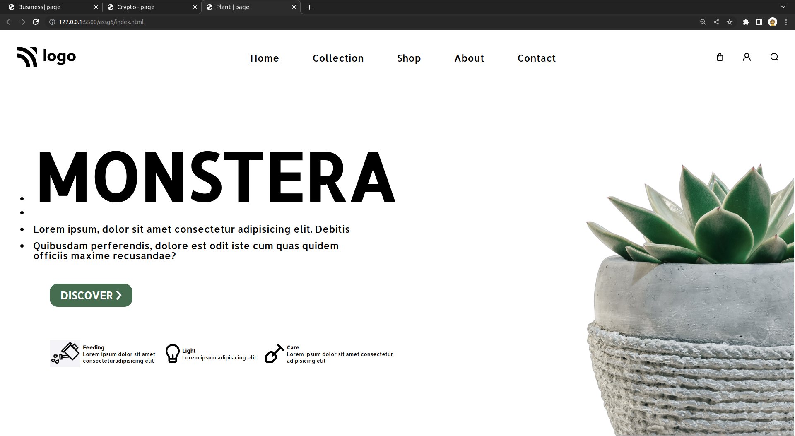

# Plant | Page - HTML & CSS!

By Prince Kr Paswan

## [Link to the Plant-Page (project-6)](https://plant-page.netlify.app/)

## What I learned While creating this page?

- Learnd to use css position  property.
- learned anout icon and there positioning.
- I learned how to add custom fonts.
- I learned about image positioning and image hight.

## This project took around 4 hours to complete.
